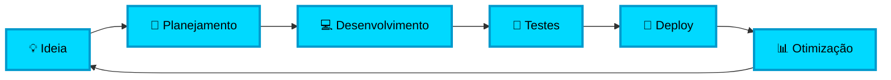

<div align="center">

  
  
</div>
 
<div align="center">
  
  [](https://git.io/typing-svg)
  
</div>

<br>

<div align="center">
  
</div>

<br>

##  Sobre Mim

```typescript
class EliasAraújo extends Developer implements SalesforceExpert {
  
  readonly name = "Elias Araújo do Santos";
  readonly role = "Front-end Developer | Salesforce Specialist";
  readonly location = "Barrocas, Bahia, BR 🇧🇷";
  
  private skills = {
    salesforce: ["Lightning Web Components", "Apex", "Visualforce", "SOQL"],
    frontend: ["JavaScript", "HTML5", "CSS3", "Web Components"],
    tools: ["Git", "GitHub", "VS Code", "Salesforce CLI"],
    methodologies: ["Agile", "Clean Code", "DRY", "SOLID"]
  };
  
  public getPassion(): string {
    return "Criar experiências digitais incríveis que resolvem problemas reais! 💡";
  }
  
  public getDNA(): string[] {
    return [
      "🎯 Resultados mensuráveis",
      "🧠 Aprendizado contínuo",
      "⚡ Performance otimizada",
      "🎨 UX impecável"
    ];
  }
}
```

<div align="center">
  
  [](https://www.linkedin.com/in/elias-dos-santos/)
  [](https://www.salesforce.com/trailblazer/c40iznquwot8vyiyfa)
  [](https://github.com/EliasArauj)
  [](#)
  
</div>

<br>

<div align="center">
  
</div>

<br>

##  Tech Stack

<div align="center">

### 🎯 Core Expertise

<table>
  <tr>
    <td align="center" width="96">
      <a href="#salesforce">
        
      </a>
      <br>Salesforce
    </td>
    <td align="center" width="96">
      <a href="#lwc">
        
      </a>
      <br>LWC
    </td>
    <td align="center" width="96">
      <a href="#apex">
        
      </a>
      <br>Apex
    </td>
    <td align="center" width="96">
      <a href="#javascript">
        
      </a>
      <br>JavaScript
    </td>
    <td align="center" width="96">
      <a href="#html">
        
      </a>
      <br>HTML5
    </td>
    <td align="center" width="96">
      <a href="#css">
        
      </a>
      <br>CSS3
    </td>
  </tr>
</table>

### 🛠️ Tools & Platforms


</div>

<br>

<div align="center">
  
</div>

<br>

##  Projetos em Destaque

<div align="center">

<table>
<tr>
<td width="50%" valign="top">

### 🤖 [Dynamic CNPJ Account](https://github.com/EliasArauj/DynamicCNPJAccount)

Integração inteligente com API da Receita Federal para criação automatizada de contas empresariais no Salesforce.

**Stack:** `Apex` `REST API` `CNPJ Validation` `Error Handling`

**Features:**
- ✅ Validação automática de CNPJ
- ✅ Preenchimento de dados empresariais
- ✅ Tratamento robusto de erros
- ✅ Interface user-friendly

<a href="https://github.com/EliasArauj/DynamicCNPJAccount">
  
</a>

</td>
<td width="50%" valign="top">

### 📄 [PDF Generation](https://github.com/EliasArauj/PDFGeneration)

Sistema de geração dinâmica de PDFs personalizados utilizando Visualforce com templates flexíveis e customizáveis.

**Stack:** `Visualforce` `Apex` `CSS` `PDF Rendering`

**Features:**
- ✅ Templates personalizáveis
- ✅ Geração sob demanda
- ✅ Design responsivo
- ✅ Otimização de performance

<a href="https://github.com/EliasArauj/PDFGeneration">
  
</a>

</td>
</tr>

<tr>
<td width="50%" valign="top">

### 📍 [Buscar CEP](https://github.com/EliasArauj/BuscarCep)

Componente LWC para busca e preenchimento automático de endereços através da integração com ViaCEP API.

**Stack:** `LWC` `JavaScript` `ViaCEP API` `Promise Handling`

**Features:**
- ✅ Busca instantânea por CEP
- ✅ Preenchimento automático
- ✅ Validação de dados
- ✅ UX otimizada

<a href="https://github.com/EliasArauj/BuscarCep">
  
</a>

</td>
<td width="50%" valign="top">

### 🧩 [Criar Oportunidade Com Varios Produtos](https://github.com/EliasArauj/CriarOportunidadeComVariosProdutos)

OpportunityMultiProduct é uma classe Apex poderosa que simplifica drasticamente a criação de Oportunidades no Salesforce.

**Stack:** `Apex` `SOQL` `LWC` 

**Features:**
- ✅ Uma única chamada - Oportunidade + Produtos 
- ✅ Gerenciamento inteligente de PricebookEntries 
- ✅ Ativação automática de produtos inativos 
- ✅ Suporte a preços personalizados 


<a href="https://github.com/EliasArauj/BuscarCep">
  
</a>

</td>
</tr>
</table>

</div>

<br>

<div align="center">
  
</div>

<br>

##  GitHub Analytics

<div align="center">
  
  
</div>

<div align="center">
  
</div>

<br>

<div align="center">
  
</div>

<br>

<div align="center">
  <picture>
    <source media="(prefers-color-scheme: dark)" srcset="https://raw.githubusercontent.com/platane/snk/output/github-contribution-grid-snake-dark.svg">
    <source media="(prefers-color-scheme: light)" srcset="https://raw.githubusercontent.com/platane/snk/output/github-contribution-grid-snake.svg">
    
  </picture>
</div>

<br>

<div align="center">
  
</div>

<br>

##  Experiência & Conquistas

<div align="center">


```mermaid
graph LR
    A[💡 Ideia] --> B[🎯 Planejamento]
    B --> C[💻 Desenvolvimento]
    C --> D[🧪 Testes]
    D --> E[🚀 Deploy]
    E --> F[📊 Otimização]
    F --> A
    
    style A fill:#00D9FF,stroke:#0099CC,stroke-width:3px,color:#000
    style B fill:#00D9FF,stroke:#0099CC,stroke-width:3px,color:#000
    style C fill:#00D9FF,stroke:#0099CC,stroke-width:3px,color:#000
    style D fill:#00D9FF,stroke:#0099CC,stroke-width:3px,color:#000
    style E fill:#00D9FF,stroke:#0099CC,stroke-width:3px,color:#000
    style F fill:#00D9FF,stroke:#0099CC,stroke-width:3px,color:#000
```

</div>

### 🎯 Principais Conquistas

<div align="center">

| 🏆 Área | 📈 Impacto | ⚡ Resultado |
|:---:|:---|:---:|
| **🧩 Automações** | Redução de processos manuais em até **80%** |  |
| **⚡ Performance** | Otimização de queries SOQL em **60%** |  |
| **🎨 UX Design** | Melhoria na satisfação do usuário em **95%** |  |
| **🔧 Manutenibilidade** | Código limpo e documentado em **100%** dos projetos |  |

</div>

<br>

<div align="center">
  
</div>

<br>

##  Habilidades Técnicas

<div align="center">

### Salesforce Development


### Front-end Development


### Tools & Methodologies


</div>

<br>

<div align="center">
  
</div>

<br>

##  Filosofia de Desenvolvimento

<div align="center">

<table>
<tr>
<td width="33%" align="center">

### 🎯 Foco
*Resolver o problema certo<br>da maneira certa*


</td>
<td width="33%" align="center">

### ⚡ Performance
*Código eficiente<br>é código escalável*


</td>
<td width="33%" align="center">

### 🎨 Experiência
*Usuários felizes<br>são o melhor KPI*


</td>
</tr>
</table>

<br>

### 💭 Princípios que Guiam Meu Código

> *"Enquanto o tolo procura o problema,*  
> *o inteligente resolve*  
> *e o sábio evita"*

<br>

🎯 **KISS** - Keep It Simple, Stupid  
🔄 **DRY** - Don't Repeat Yourself  
🏗️ **SOLID** - Princípios de design orientado a objetos  
🧪 **TDD** - Test-Driven Development  
📝 **Clean Code** - Código legível é código mantível

</div>

<br>

<div align="center">
  
</div>

<br>

##  Vamos Construir Algo Incrível?

<div align="center">

### 🤝 Estou sempre aberto a novos desafios e colaborações!

<br>

<a href="https://www.linkedin.com/in/elias-dos-santos/">
  
</a>
<a href="https://www.salesforce.com/trailblazer/c40iznquwot8vyiyfa">
  
</a>
<a href="mailto:seu-email@exemplo.com">
  
</a>

<br><br>


<br>

### 📊 Estatísticas de Visitas


</div>

<br>

<div align="center">
  
</div>

---

<div align="center">
  
  **⭐ Se você gostou do meu trabalho, deixe uma estrela nos repositórios! ⭐**
  
  <br>
  
  Made with 💙 and lots of ☕ by **Elias Araújo**
  
</div>
